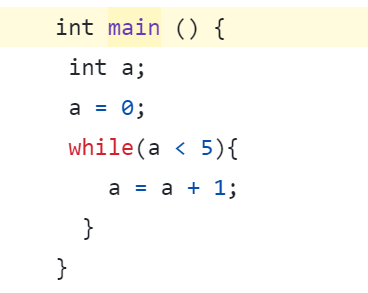

### Exemple de code .c que le compilateur peut transformer en langage assembleur


>Le fichier compile.cpp est le main() du projet.<br/>
>Pour compiler : 
>```bash  
>    g++ compilation.gcc -o compilation
>``` 

> ENTREE: Pour charger un test, il faut changer le chemin de lecture du fichier :```std::string chemin;``` qui est dans le fichier <strong>compile.cpp</strong>.
> 
> SORTIE: L'écriture du code assembleur par le compilateur est dans la sortie standard (dans le terminal).

 
> ### Analyse lexicale (Lexing) :
> Le compilateur commence par lire le code source et le décompose en une série de tokens. Les tokens sont les unités lexicales de base du langage, comme les mots-clés (if, while, int), les identificateurs (noms de variables et de fonctions), les opérateurs (+, -, *, /), et les symboles de ponctuation ({, }, (, )).
> ### Analyse syntaxique (Parsing) :
> Ensuite, le compilateur analyse les tokens pour vérifier que le code respecte la syntaxe du langage C. Cette étape génère un arbre syntaxique abstrait (AST, Abstract Syntax Tree), qui représente la structure grammaticale du code source.
> ### Analyse sémantique :
>Le compilateur vérifie ensuite les règles sémantiques du langage, comme les types de données et la portée des variables. Il effectue des vérifications de type, vérifie les déclarations de variables, et assure que les opérations sont valides (par exemple, qu'on ne tente pas d'ajouter une variable entière à une chaîne de caractères).
> ### Génération de code (Code Generation) :
> Une fois les optimisations effectuées, le compilateur traduit le code intermédiaire en code assembleur spécifique à l'architecture cible. Le code assembleur est une représentation de bas niveau du programme, utilisant des instructions spécifiques au processeur sur lequel le programme sera exécuté.